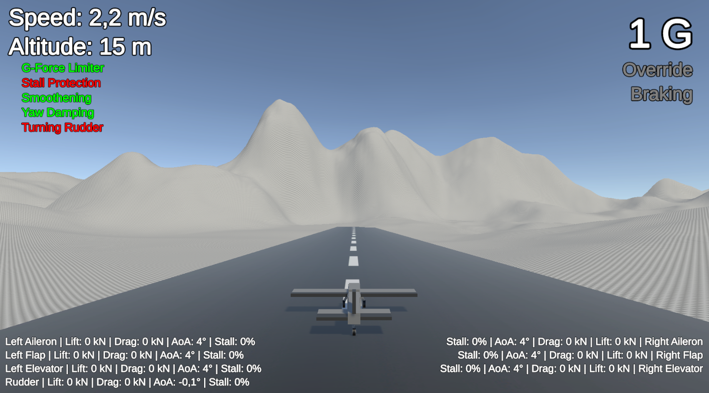
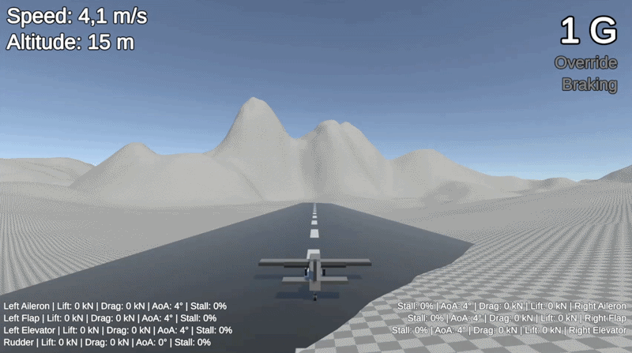
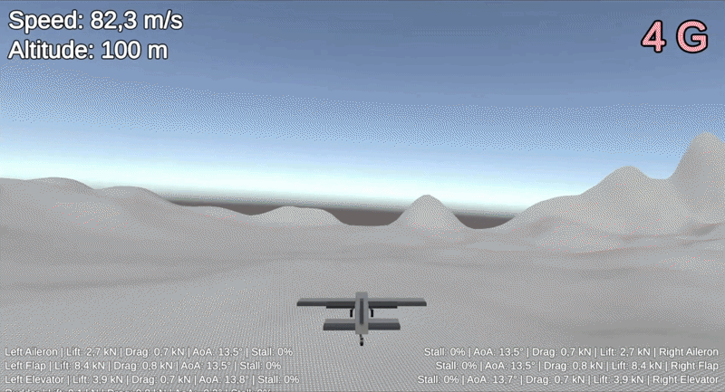
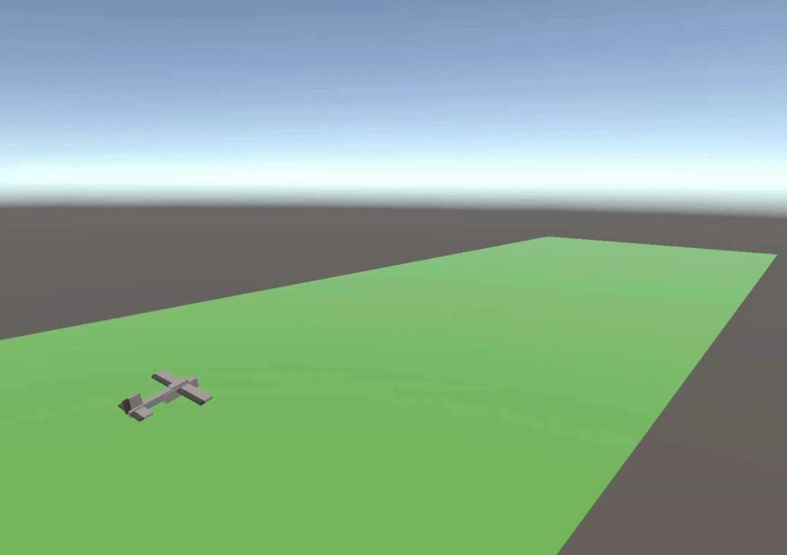

# Autonomous Aerial Systems
**Real-time flight simulation, autonomous controls and air combat research in Unity.**

This project explores how advanced control systems, artificial intelligence and machine learning can be used to simulate air combat. Development moves forward through a series of prototypes, each introducing new aerodynamics, systems or autonomy.

The project is developed as a solo engineering project with a focus on prototyping and experimentation.

Checkout my !

## Project Goals

The long-term goal is to develop a complete autonomous air combat simulation, that includes:
 - Real-time aerodynamic flight simulation.
 - Control surface and wing-camber-based maneuvering.
 - Autonomous within visual range (WVR) combat.
 - Missile guidance and interception.
 - Aircraft maneuvered through artificial neural networks.

## Current Status

The latest release, `v0.3.1`, is the `Fly-By-Wire Prototype`. This prototype extends the previous prototype, the `Wing Camber Prototype`, with a fly-by-wire system, that contains:

 - G-force limiting
 - Stall protection
 - Yaw damping
 - Turn assistance
 - Input/deflection smoothening

Current project content:

 - 4 aircraft prototypes
 - 3 test scenes
 - 3 aerodynamic models
 - 1 fly-by-wire system

For more information about recent releases, check out the [Development Log](./docs/devlog.md) and [Releases](https://github.com/va-universe/Autonomous-Aerial-Systems/releases).

## Prototype Progression

| Release | Prototype | Focus |
|----------|----------|----------|
| v0.1.0 | Aerodynamic Surface Prototype | Distributed aerodynamic forces |
| v0.2.0 | Wing Camber Prototype | Wing-camber-based aerodynamics and stalling |
| v0.3.0 | Fly-By-Wire Prototype | Flight assistance systems (FBW) |
| v0.4.0 | Rule-Based AI Prototype | Autonomous flight without neural networks |

## Next Release

The next planned release, `v0.4.0`, is the `Rule-based AI Prototype`. This release will introduce autonomous flight using rule-based systems, including waypoint and plane tracking, terrain avoidance and autonomous maneuvering. 

## Roadmap

Current development path (subject to change):

 - [x] Aerodynamic Surface Prototype
 - [x] Wing Camber Prototype
 - [x] Fly-By-Wire Prototype
 - [ ] Rule-based AI Prototype
 - [ ] Weapon Systems Prototype
 - [ ] Combat AI Prototype
 - [ ] Neural Network Prototype
 - [ ] Curriculum Learning Prototype
 - [ ] JAS 39 Gripen E

See the full roadmap in [Roadmap](./docs/roadmap.md).

## Documentation

 - [Manual](./docs/manual.md)
 - [Running Instructions](./docs/running-instructions.md)
 - [Development Log](./docs/devlog.md)
 - [Roadmap](./docs/roadmap.md)
 - [Workflow](./docs/workflow.md)
 - [Release Notes](https://github.com/va-universe/Autonomous-Aerial-Systems/releases)

## How To Run

### Requirements

 - Unity Hub
 - Unity `6000.3.12f1`

### Running

For a more in-depth guide, check out the [Running Instructions](./docs/running-instructions.md).

 1. Clone or download the repository.
 2. Open the project using Unity Hub.
 3. Open one of the prototype scenes located in `Assets/Scenes`.
 4. Press Play.

See the [Manual](./docs/manual.md) for controls and prototype information.

## Media

### Fly-By-Wire Prototype

## Wing Camber Prototype

## Aerodynamic Surface Prototype

## First Aircraft Prototype

